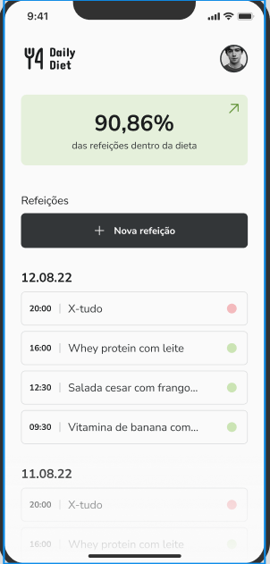

## Descrição

#### Projeto desenvolvido durante o curso de react-native da rocketseat. O app permite o usuário registrar, atualizar e excluir refeições, contando também com uma página de estatísticas, onde é mostrado a quantidade de refeições registradas, númbero de refeições dentro da dieta, fora da dieta, porcentagem de refeições dentro da dieta e sequência de refeições dentro da dieta.

## Rodando o projeto

```
npm install

npm start
```
